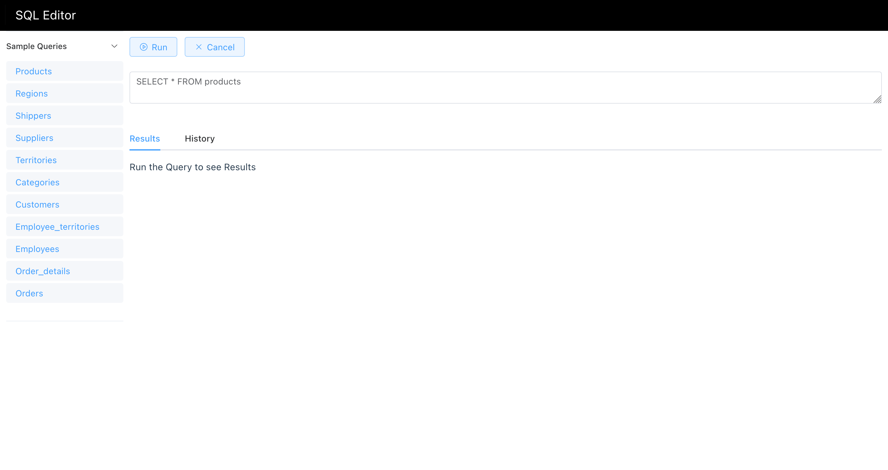
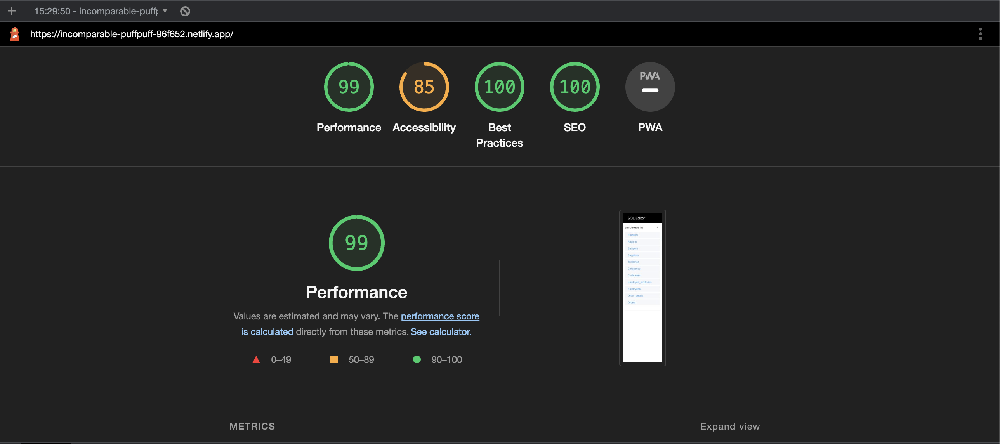

# sql-editor

Live Link : https://incomparable-puffpuff-96f652.netlify.app/
# Screen Shot

# Lighthouse


# Tech Stack
Vue js 3, Element Ui, Pinia
# Features

- Users can run pre-defined queries fetched from Github API
- Added pagination to render large amount of data
- Saving the history of commands that user ran.
---
## Recommended IDE Setup

[VSCode](https://code.visualstudio.com/) + [Volar](https://marketplace.visualstudio.com/items?itemName=Vue.volar) (and disable Vetur) + [TypeScript Vue Plugin (Volar)](https://marketplace.visualstudio.com/items?itemName=Vue.vscode-typescript-vue-plugin).

## Customize configuration

See [Vite Configuration Reference](https://vitejs.dev/config/).

## Project Setup

```sh
npm install
```

### Compile and Hot-Reload for Development

```sh
npm run dev
```

### Compile and Minify for Production

```sh
npm run build
```

### Lint with [ESLint](https://eslint.org/)

```sh
npm run lint
```
